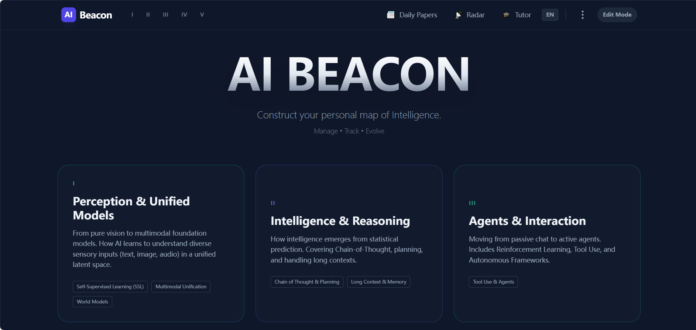

# 📡 AI Beacon


**AI Beacon** 是一个智能、可定制的 **个人知识库 (PKB)**，专为 AI 研究人员和工程师设计。

在 ArXiv 上每天都会发布数十篇前沿论文，单靠人工跟进几乎不可能。AI Beacon 通过结合结构化的思维地图（“AI 支柱”）和 **智能代理能力** 来解决这一问题。它不仅存储链接，还能自动抓取摘要、更新引用次数、寻找相关新工作，并充当复杂概念的辅导助手。

> **“构建你的个人智能地图。”**



---

## 🔗 文档

| 文档 | 描述 | 文件 | 描述 |
|------|------|------|------|
| [完整用户手册 (中文版)](./docs/full_user_manual-cn.md) | 所有功能的详细说明 | [Full User Manual (English)](./docs/full_user_manual-en.md) | Detailed explanation of all features |

## 🔗 快速跳转
| 部分 | 描述 | Section | Description |
|------|------|--------|------------|
| [核心功能](#-key-features) | 系统功能总览 | Key Features | Overview of system capabilities |
| [快速上手](#-getting-started) | 如何配置与运行本项目 | Getting Started | How to configure and run this project |
| [基础使用指南](#-quick-usage-guide) | 界面按钮与最小可用流程 | Quick Usage Guide | Basic UI intro & minimal usage workflow |
| [项目结构](#-project-structure) | 项目结构说明 | Project Structure | Project Structure Description |
| [常见问题](#-faq) | 常见问题与可能的解决方案 | FAQ | Common problems and possible solutions |

## ✨ 核心功能

### 🏗️ 结构化、完全可编辑的知识架构
本项目将研究知识组织为三层：
- **领域 (Pillars)** — 顶层概念领域（如“感知与统一模型”）
- **主题 (Topics)** — 每个领域下的子方向（如自监督学习 SSL）
- **论文/资料 (Papers / Artifacts)** — 论文、数据集、代码库、笔记或视频

系统预装了精选本体，但 **每个元素都是可编辑的**。没有锁定分类——用户可以添加、重命名、删除或重新组织条目。

#### 默认领域
系统包含以下默认领域（可修改）：
1. **感知与统一模型**：`自监督学习 (SSL)`、`多模态统一`、`世界模型`
2. **智能与推理**：`思维链与规划`、`长上下文与记忆`
3. **代理与交互**：`工具使用与智能代理`（如强化学习、具身 AI 等将未来集成）
4. **安全与对齐**：`价值对齐`（如可解释性、AIGC 安全、模型安全等将未来集成）
5. **效率与扩展**：`扩展法则`、`架构优化`（如量化、高效注意力等将未来集成）

### 🤖 AI 驱动的工作流（由 Gemini 2.5 提供支持）
- **✨ 智能自动填充**：输入论文标题（如 "DINOv3"），AI 自动抓取作者、发布日期、摘要、GitHub 星标及 PDF 链接。
- **📊 实时统计同步**：一键刷新以获取任意论文最新的引用数和 GitHub 星标。
- **🔎 研究雷达**：针对某个主题扫描最新论文（2024-2025）。
- **📥 智能暂存区**：AI 发现的新论文不会立即进入库，而是进入暂存区，由你决定合并。
- **🎓 AI 导师**：内置聊天界面，像资深研究员一样解释数学概念或架构细节。

### 🛡️ 本地优先 & 协作友好
- **隐私优先**：API Key 保留在本地环境中。数据存储在 `localStorage` 和本地数据库（如已关联）。强烈建议使用本地文件（如 `./public/knowledge-base.json`）以防数据丢失并增强团队协作。
- **导入/导出**：可通过 JSON 分享特定 **主题** 或整个 **领域 (Pillars)** 给同事，轻松进行协作编辑。
- **评论**：可在每篇论文上添加评论，记录想法或与团队共享——通过同步共享数据库文件即可实现（如将共享数据库文件上传到 Nutstore APP，然后关联该文件，而非 `./public/knowledge-base.json`）。

---

## 🚀 快速上手

### 环境要求
- **Node.js** (v16 或更高)
- **Google Gemini API Key**（免费申请：[链接](https://aistudio.google.com/app/apikey)）

### 使用步骤
1. **克隆仓库**
   ```bash
   git clone https://github.com/Suchenl/AI-Beacon-Web.git

2. **赋予可执行权限 (macOS，Windows 可跳过)**

   ```bash
   xattr -r -d com.apple.quarantine AI-Beacon-Web
   ```
3. **安装依赖并初始化配置**

   * **Windows**：双击 `AI-Beacon-Web\quick_start_win\init.bat`
   * **macOS**：双击 `AI-Beacon-Web/quick_start_os/init.command`
4. **运行应用**

   * **Windows**：双击 `AI-Beacon-Web\quick_start_win\run.bat`
   * **macOS**：双击 `AI-Beacon-Web/quick_start_os/run.command`

---

## 🚀 基础使用指南

### 1. 编辑模式

点击右上角 **"Edit Mode"** 按钮，即可：

* 创建/删除 Pillars 和 Topics
* 拖放式管理（未来功能）
* 手动添加论文

### 2. 添加新论文

1. 进入某个主题（如 "自监督学习"）
2. 点击 **"+ Add Paper manually"**
3. **快捷方式**：输入论文标题（如 *Masked Autoencoders*），点击 **✨ AI Fill**
4. 系统将自动抓取摘要、日期、作者和代码链接
5. 点击保存

### 3. 保持更新

* **查找新论文**：点击任意 Pillar 中的 "🔎 Find New Papers" 按钮，AI 搜索近期突破（2024-2025），排除已有论文。
* **刷新统计**：点击论文卡片的循环/刷新图标，更新引用数和星标数。

### 4. 导出与分享

* **导出 Pillar**：点击 Pillar 标题旁下载图标，保存整个领域为 JSON。
* **导出 Topic**：点击 Topic 标题旁下载图标。
* **导入**：主页底部（Pillars）或主题列表底部（Topics）使用导入按钮加载他人共享的 JSON 文件。

---

## 📁 项目结构

```
ai-beacon/
├── assets/              # 资源文件 (图标、图片)
├── prompts/             # AI 提示语
├── public/              # 公共资源
├── quick_start_win/
│   ├── init.bat         # 安装依赖并初始化配置 (Windows)
│   ├── run.bat          # 运行应用 (Windows)
├── quick_start_os/
│   ├── init.command     # 安装依赖并初始化配置 (macOS)
│   ├── run.command      # 运行应用 (macOS)
├── src/                 # 应用源代码
│   ├── App.tsx
│   ├── index.tsx
│   ├── View*.tsx
│   └── ...
├── index.html           # HTML 模板
├── package.json         # Node.js 配置
├── vite.config.ts       # Vite 配置
├── tsconfig.json        # TypeScript 配置
└── README.md            # 英文 README
```

## ❓ 常见问题
**Q1: 执行init文件时，除了Gemini，还可以选择其他模型的API进行初始化吗？**

*A1: 现在的版本只能使用Gemini，使用其他模型可能会出错，后续的版本可能会提供支持*

**Q2: 知识库每次打开都要重新链接吗？**

*A2: 第一次链接时，用户可以选择保持链接，并让浏览器记住选项，此后应不会再提醒。并且刷新和重启软件也不会断开链接，除非手动断开。*

**Q3: 现在可以支持多人同步实时协作吗？**

*A3: 可以的。开发者建议使用坚果云等文件共享软件进行知识库的共享，这样在一端用户进行更新之后（例如添加新的论文，或者添加新的评论），另一端用户刷新后即可看见。*

**Q4: 现在可以联网协作吗？**

*A4: 软件内部暂不支持此功能，作为一个对云端软件不信任的开发者，本项目的初心就是构建一个本地知识库，将数据存储在本地。但为方便实时团队协作，我们提供了另一种解决方案，可参考Q3。*

**Q5: AI查找新论文的功能靠谱吗？有幻觉吗？**

*A5: 在此项目中，我们有意避免AI幻觉，尽量返回最精准的论文数据，具体来说，查找新论文功能的实现流程为：*
- *1.通过严格的提示词让 AI 尽量返回真实的论文，总结，摘要，其对应的论文和代码链接，以及对应的引用和github星标数量*
- *2.验证基本字段（题目, 论文链接, 作者 等）是否符合格式要求*
- *3.实际访问 link，提取页面标题，比较提取的标题和论文标题是否匹配*
- *4.如果不匹配 → 添加 critical error → 拒绝论文*
- *5.如果不匹配或无法验证或出现RECITATION等问题 → 继续处理*
- *6.循环尝试三次，如果还是不匹配，则跳转到下一篇论文检索*
*因此，有时候查找n篇，但返回数量不到n篇是常见现象*

**Q6: AI查找新论文的功能很耗时间，可以优化吗？**

*A6: 数据的保真度和返回快速性是两个需要权衡的点，我们会尝试在下一个版本中进行优化。*

**Q7: AI查找新论文的时候可以进行其他操作吗？会打断这个过程吗？**

*A7: 只要不退回到主页，就不会断开这个过程，在实际使用时，您可以过一会儿再回来查看。*

## 🛠️ 技术栈

* **前端**：React 19, TypeScript, Vite
* **样式**：Tailwind CSS
* **AI/LLM**：Google Gemini API (`gemini-2.5-flash`) + Google 搜索 Grounding
* **图标**：Heroicons / 自定义 SVG
* **Markdown**：`react-markdown`
* **打包工具**：Go (用于可执行文件打包)

---

## 🤝 贡献

欢迎贡献！如果你是研究者，可提交 PR 更新 `INITIAL_PILLARS` 常量，加入你领域内的经典论文。

### 如何贡献

1. Fork 项目
2. 创建功能分支 (`git checkout -b feature/AmazingFeature`)
3. 提交修改 (`git commit -m 'Add some AmazingFeature'`)
4. 推送分支 (`git push origin feature/AmazingFeature`)
5. 创建 Pull Request

### 开发指南

* 遵循现有代码风格
* 为新功能添加文档
* 必要时更新 README
* 提交前测试修改

---

## ⚠️ 免责声明

本项目通过 **LLM 网页抓取** 实现功能，请尊重请求频率并合理使用。默认 API Key 使用为客户端，本项目 **请勿直接部署至公共 URL**，需添加后端代理保护 API Key。

---

## 📄 许可证

Apache 2.0 许可，详见 `LICENSE` 文件。

---

## 🙏 致谢

* 使用 [Vite](https://vitejs.dev/) 和 [React](https://react.dev/) 构建
* 由 [Google Gemini](https://deepmind.google/technologies/gemini/) 提供 AI 支持
* 图标来自 [Heroicons](https://heroicons.com/)

---

## 📞 支持

* **问题反馈**：[GitHub Issues](https://github.com/Suchenl/AI-Beacon-Web/issues)

---

**献给 AI 研究社区 ❤️**

**如果您觉得本项目对您有所帮助，请给它点个赞⭐！您的支持对我们意义重大，也是我们不断改进和更新项目的动力。谢谢！**
